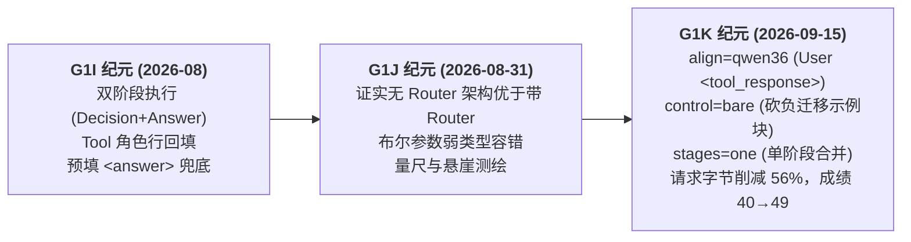

# 工具调用与对话格式总览 (Tool Calling & Dialogue Wire Formats)

> 本文档是 RWKV-Agent 中所有关于**模型对话模板**、**工具调用信封（Wire Format）**、**语料格式契约**与**运行时配置**的权威导引总门户。

---

## 1. 为什么需要 Wire 格式？

RWKV 的核心能力是“给定完整文本前缀，继续生成文本”（无状态续写）。模型本身并不理解 OpenAI 风格的 `roles`、JSON schema 或原生 tool call。为了让 RWKV 具备可靠的多轮 Agent 工具调用与推理能力，本项目在底层续写与应用业务之间建立了清晰的分层：

```text
Agent Runner (业务循环调度)
  ├── ActionProtocol (动作说明、输出提取、容错与终答判定)
  ├── PromptRenderer (将结构化 transcript 渲染为模型可见的完整字节流)
  └── continuation.Generator (纯续写接口: 仅输入 prompt 与采样参数，返回流式文本)
```

**Wire Spec**（`internal/agent/wire.Spec`）即为定义“模型看到什么字节、我们怎么解析它”的核心规范对象。

---

## 2. 核心文档快速导航

根据你的关注点，直接查看对应文档：

| 关注维度 | 推荐入口 | 核心内容与受众 |
| --- | --- | --- |
| **语料生产与清洗** | [`docs/corpus-g1k-wire-format.md`](corpus-g1k-wire-format.md) | **数据侧逐字节契约**：System 模板、`<tools>` JSON 目录、三种 Assistant 动作、User 轮工具结果、单阶段纯文本终答、新旧形状对照表 |
| **消融实验与实测证据** | [`docs/evaluations/g1k-wire-ablation/wire-ablation-g1k-summary-20260915.md`](evaluations/g1k-wire-ablation/wire-ablation-g1k-summary-20260915.md) | **G1K 格式消融总结**：R0–R4 逐轮实测、三条核心教训、跨套件分数卡（40→49 题，请求字节 −56%）、4 条语料靶子 |
| **运行时配置与 CLI 选项** | [`docs/wire-configuration.md`](wire-configuration.md) | **Wire Spec 参数全表**：`--profile` 预设点、`--wire key=value` 覆写轴、canonical 归一化规范（受 Go 单元测试严格守护） |
| **架构与协议实现** | [`docs/continuation-and-agent-protocol.md`](continuation-and-agent-protocol.md) | **Go 接口分层与生命周期**：ActionProtocol、PromptRenderer 与本地/远程 Provider 的映射边界 |

---

## 3. 现行推荐格式（G1K 最佳实践）

2026-09-15 在最新 G1K 模型上的消融测试表明，最薄、最高效的推荐 Profile 为：

```sh
--profile xml-v1+align-qwen36+no-tool+bare+one-stage
```

### 格式关键要素：

1. **System 块**：
   - 包含简短角色定义与行为约束。
   - 工具目录使用 `<tools>` 包裹的标准 JSON 数组形式挂载于 System 末尾。
2. **User / Assistant 交替**：
   - 仅使用 `System:`、`User:`、`Assistant:` 三种角色行，**废弃历史 `Tool:` 角色行**。
   - 块与块之间恰好分隔一个空行（`\n\n`）。
3. **工具调用（Assistant）**：
   - 使用 `<tool_call>{"name":"...","arguments":{...}}</tool_call>` 标签。
4. **工具结果回填（User）**：
   - 统一由 User 发出 `<tool_response>{"name":"...","content":{...}}</tool_response>`。
5. **纯文本单阶段终答（Single-stage Final Answer）**：
   - 废除历史的 `<answer>` 预填与独立重发阶段；得到充足证据后，模型直接在当前轮次输出纯文本完成作答。
6. **无虚假示范（Bare Control）**：
   - 移除 System prompt 中诱导模型强行调用工具的“发明检索”示例块，赋予模型直接文本回答的自由。
7. **语义弃权出口（No-tool Exit）**：
   - 在无需或无法使用工具时，模型可选择 `no_tool` 动作或直接文字作答。

---

## 4. 格式形态全景对比矩阵

| 格式名称 | 适用场景 | 工具调用语法 | 结果回填语法 | 终答机制 | 状态 |
| --- | --- | --- | --- | --- | --- |
| **G1K 现行推荐** (`xml-v1` + `align-qwen36` + `bare` + `one-stage`) | G1K 及后续模型默认产品路径 | `<tool_call>{"name":...}` | `User: <tool_response>{...}` | 单阶段纯文本终答（无 `<answer>`） | **现行标准** |
| **Legacy XML** (`xml-v1`) | G1I 历史基线与 Boundary 密集型重任务 | `<tool_call>{"name":...}` | `Tool: <tool_result>{...}` | 双阶段，预填 `<answer>` 独立作答 | 兼容保留 |
| **Product Markdown** (`markdown-v1`) | 适合偏好 Markdown 输出的特定任务 | ```` ```json\n[{"name":...}] \n``` ```` | `Tool: ...`（纯文本/块状） | 直接输出普通 Markdown | 现行可选 |
| **Primitive Benchmark** | 针对 Primitive Bench 30 题 benchmark 评测 | Markdown JSON fence | 固定单行回填 | 需调用 `submit` 工具终止 | 专用评测 |
| **Native Function Calling** | 接入第三方 OpenAI-compatible Chat 服务 | API 原生 `tool_calls` 结构 | API 原生 `role: tool` | 官方服务自然终答 | Provider 支持 |

---

## 5. 模型纪元与格式演进脉络



- **G1i 阶段**：建立了首个可用 Harness，针对 13B 与 7.2B 摸索出深锚点（`{"name":"`）和双阶段分离控制，但代价是 prompt 膨胀、依赖 `<answer>` 预填。
- **G1j 阶段**：完成了无 Router 架构的有效性验证与布尔强转容错（见 `tools.go`），并产出了偏好重建三部曲。
- **G1k 阶段**：通过彻底消融，证明了“示例块是负资产”与“两阶段合一可行”，形成了当前最薄、最接近工业标准的通用契约。
